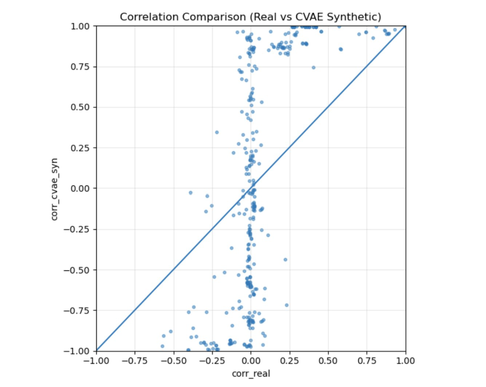

# Model Collapse in Tabular Generation Models

**Authors:** Yuxiang Wei, Xingxiang Huang, Warren Wu, Jared Gode  
**Date:** December 2025  

This repository accompanies the paper:

> *Model Collapse in Tabular Generation Models*

---

## Overview

Recent work has shown that generative models can suffer from **model collapse** when repeatedly trained on their own synthetic outputs, leading to distorted distributions, reduced diversity, and hallucinated structure. While this phenomenon has been well documented in large language models, its behavior in **tabular data generation** remains underexplored.

This project investigates whether common tabular data generators exhibit analogous collapse effects under **iterative synthetic-on-synthetic training**, and why such collapse occurs even when downstream predictive performance may temporarily improve.

---

## Core Research Question

> **Why do tabular generative models collapse under synthetic-on-synthetic training, and how does this collapse manifest statistically and empirically?**

We study three representative model families:
- GAN-based models (CTGAN)
- Likelihood-based latent variable models (CVAE)
- Autoregressive LLM-based generators (GReaT)

Across all methods, we observe collapse behaviors driven by error reinforcement, smoothing of structure, and distributional feedback loops.

---

## Dataset and Evaluation Setting

- **Domain:** Click-through-rate (CTR) prediction
- **Scale:** ~7.7M training rows, ~1M test rows
- **Label imbalance:** ~1.5% positive (clicked)
- **Features:** User behavior, device attributes, temporal signals
- **Downstream task:** CTR prediction on a fixed real test set

A curated **Safe Top-27** feature set is used throughout to avoid leakage and ensure consistent evaluation.

Downstream utility is measured using **LightGBM**, evaluated on held-out real data via ROC-AUC, PR-AUC, and F1.

---

### Downstream Utility
Synthetic datasets are used to train LightGBM models, which are always evaluated on a fixed held-out real test set. This isolates the effect of synthetic data quality from model choice.

### Statistical Fidelity

We explicitly measure whether synthetic data preserves **structural properties of the original dataset**, using the following criteria:

- **Minority-class ratio preservation (dataset level).**  
  We track how closely synthetic datasets match the original CTR rate (~1.5%), and how this ratio evolves across synthetic retraining iterations. Deviations indicate reinforcement of class imbalance and early signs of collapse.

- **Adherence to data type and domain constraints (row level).**  
  We verify that generated samples respect valid ranges and categories for each feature (e.g., categorical codes, binary labels). Violations such as impossible label values or unseen categories are treated as indicators of structural breakdown.

- **Correlation structure fidelity (feature level).**  
  Pairwise feature correlations in synthetic data are compared against those in real data to detect smoothing, spurious dependencies, or loss of strong behavioral relationships.

Together, these evaluations allow us to detect collapse even in cases where downstream metrics remain stable or improve.

---

## Why Model Collapse Occurs in Tabular Generation

Across all models we study, collapse arises from a common feedback mechanism:

> **When a generator is retrained on its own synthetic data, small errors are treated as ground truth and become increasingly amplified.**

This happens for several simple reasons:

- **Imbalanced labels are reinforced.**  
  In highly skewed datasets (e.g., 1–2% positives), synthetic generators tend to oversample rare events. When retrained on this synthetic data, the generator interprets the inflated minority class as real structure, leading to runaway distortion.

- **Averaging washes out important structure.**  
  Many tabular generators are trained to favor average behavior. As a result, strong but rare feature relationships are smoothed away, especially under repeated training.

- **Synthetic artifacts accumulate over iterations.**  
  Errors introduced in early generations are not corrected. Instead, they persist and grow because later models cannot distinguish synthetic noise from genuine signal.

- **Downstream metrics can mask collapse.**  
  Predictive performance (e.g., ROC-AUC or F1) may remain stable or even improve temporarily, despite severe degradation in the underlying data distribution.

Together, these effects create a feedback loop in which **synthetic data becomes progressively less faithful to the original distribution**, even when models trained on it appear to perform well.

---

## Model Failure Modes

### CTGAN — Minority-Class Overinflation

CTGAN exhibits collapse primarily through **label distribution drift**:
- Real CTR ≈ 1.5%
- CTGAN v1 ≈ 5%
- CTGAN v2 ≈ 42%

This occurs because adversarial training amplifies rare modes when repeatedly exposed to synthetic data. While mixed real+synthetic training can improve downstream F1, **synthetic-only retraining causes severe fidelity collapse**.

---
#### CVAE: Structural Collapse via Over-Smoothing

  

**Figure (CVAE, page 21 of paper).**  
Absolute difference between pairwise correlations in real data and CVAE-generated synthetic data.

#### What This Shows

- Widespread distortion of correlation structure
- Artificial dependencies between weakly related features
- Attenuation of strong behavioral relationships

#### Why This Happens

The CVAE optimizes a reconstruction-based objective that encourages the latent space to capture *average* feature patterns. In high-dimensional, imbalanced tabular data, this leads to:

- Smoothing of rare but informative behaviors  
- Loss of higher-order interactions  
- Progressive degradation of joint structure under retraining  

Despite reasonable marginal fidelity and strong privacy properties, the CVAE fails to preserve the dependencies necessary for downstream predictive tasks.

---

### GReaT (LLM-based) — Hallucination and Instability

The LLM-based generator exhibits a different collapse mechanism:
- Hallucinated categorical values not present in the real domain
- Unstable label generation (values outside {0,1} when the feature is binary)
- Near-complete failure to recover feature-feature correlations
- Rapid degradation under synthetic-on-synthetic retraining

These failures are qualitative and systematic, reflecting a lack of structural grounding and insufficient data scale for autoregressive tabular generation.

---

## Key Takeaways

- **Model collapse is model-agnostic** in tabular generation.
- Synthetic-on-synthetic training reinforces errors rather than correcting them.
- Downstream utility alone is insufficient to detect collapse.
- Fidelity must be evaluated at multiple levels:
  - Dataset-level label balance
  - Row-level validity constraints
  - Feature-level correlation structure

---

## Why This Matters

Synthetic data is increasingly used for privacy-preserving machine-learning pipelines.  
Our results show that:

> **Improved downstream performance can coexist with severe statistical collapse.**

This highlights the need for **collapse-aware evaluation protocols** before synthetic data is deployed in real-world systems.

---

## Code

All preprocessing, modeling, and evaluation code is available here, where I was a primary contributor:

**GitHub Repository:**  
https://github.com/jackiewei-creator/CTR-Project/tree/main/Synthetic%20Data%20Generation

---

## References

Shumailov et al. (2024); Xu et al. (2019); Pagnoni et al. (2018);  
Borisov et al. (2023)
